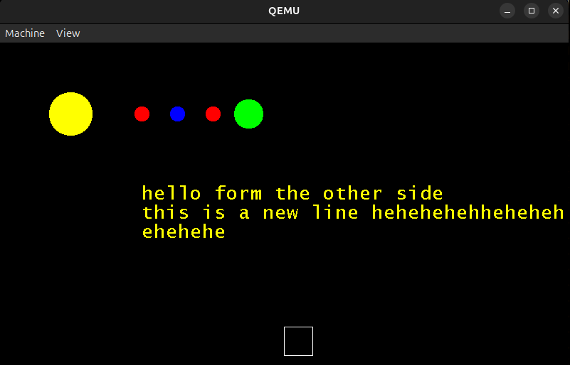
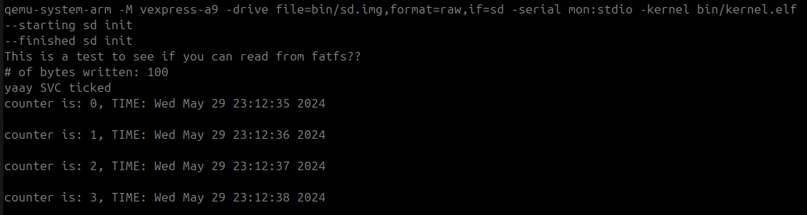

# Baremetal ARM Proramming using qemu vexpress-a9 board
This is my attempt to do baremetal programming on cortex-a9 using qemu and vexpress-a9 board.

## Working
* Keyboard using ARM (PL050)
* Display using ARM (PL111)
* Timer usin ARM (SP804)
* UART using ARM (PL011)
* SD card using ARM (PL181)
* Real Time Clock (RTC) using ARM (PL031)
* Interrrupts using ARM (GIC) and IRQ code stub
* µGUI - free and open source graphic library for embedded systems Port
* FatFs - Generic FAT Filesystem Module Port
* uClibc - C library for developing embedded Linux systems syscall Port

## Plans for Future
- [ ] Code Cleanup & Refactoring
- [ ] Better Build Script and IDE Support (Debugging, Building, and Running)
- [ ] Audio Support using ARM Advance Audio Codec Interface (PL041)
- [ ] Network Support using LAN9118 ethernet
- [ ] Porting Network Stack using lwIP
- [ ] MultiCore Support
- [ ] Better Driver Support and Imporovements
- [ ] Code Documentation and overall Walkthrough
- [ ] Detailed Walkthrough of My BareMetal Adventure

## Screenshots

